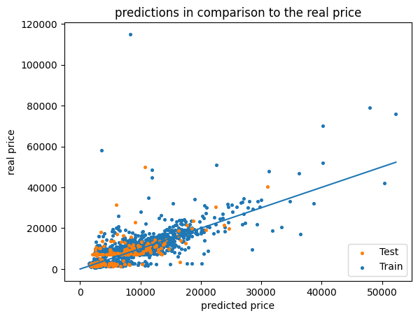
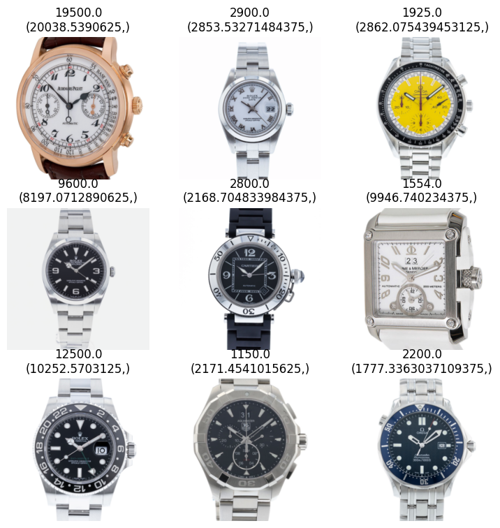
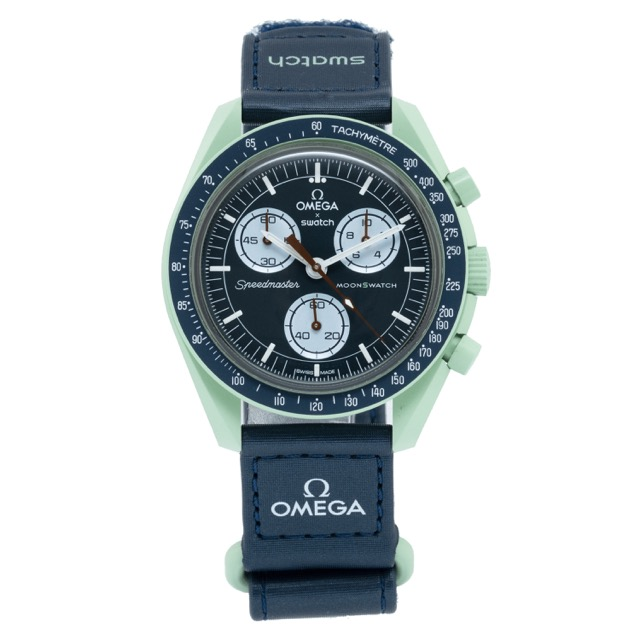

# watch-price-prediction

## Introduction
Expensive watches that you can't afford as a student are not a great hobby. 
However, if there were a way to find out which watch looks very expensive but is not. 
That way it would be possible for a poor student to splurge anyway. 
Since the appearance of a watch is particularly subjective, an objective way must be found to estimate the price of watches based on their appearance.
This is where machine learning comes into play. A model is to find out which watches look more expensive and which look cheaper on the basis of mathematical principles. 

The following project arises from this challenge.
The concrete goal is:
**Predicting the price of a watch from a picture of the watch.**


## Moral reflections on the project
When considering the moral impact the project may have on society, no explicit problems were identified.
This project also shows that there is no direct obvious aspect that determines the price of a watch. This means, for example, how gold-plated the watch is, among other things. 
Rather, it is certain models and brands that account for a certain price. 
For society, the project does not bring much added value. For watch lovers, however, it can be interesting and perhaps artificial intelligence can help jewellers determine the price of a watch in the future. 
This project started with the idea of detecting counterfeits, an ability that could actually protect jewellers from high financial losses. The problem that existed for this project, however, is the lack of a basis of watch pictures of fakes, as even fake watch online shops usually use the original pictures of the watches. 

# Data
To solve the problem, three data sets were compiled and downloaded.
The first dataset is an official dataset from Kaggle, which is freely accessible. 

## DS_1 [Kaggle - A Dataset of Watches](https://www.kaggle.com/datasets/mathewkouch/a-dataset-of-watches)

This dataset includes 2553 watch images and additional information about the brand to the name of the watch and the price in US dollars. At the time of writing, there are no public code samples for the dataset.

## DS_2 Scraped OnlineShop [Marc Gebauer](https://marcgebauer.com/collections/alle-luxus-uhren)

With the help of the [GITHub Shopify Scraper](https://github.com/lagenar/shopify-scraper) which was minimally adapted, 230 watch images from the Marc Gebauer Shop were scraped. In addition, the scraper could also record the prices of the products and save them in a CSV.

## DS_3 Scraped OnlineShop [Crown & Caliber](https://www.crownandcaliber.com/)
Also with the help of the customised [GITHub Shopify Scraper](https://github.com/lagenar/shopify-scraper), 26,216 watch images and their prices could be scraped in this online shop. 


In this project, a different dataset is used as validation dataset each time, i.e. for training and testing with ds3, ds2 becomes the validation dataset.

# Models

Three different models are used to achieve the set goal. 
1. Random Forrest Model [M1_RandomForest.ipynb](M1_RandomForest.ipynb)
2. Simple Artificial neural network [M2_simpleNN.ipynb](M2_simpleNN.ipynb)
3. Adoped pretrained resnet34 [M3_resnet.ipynb](M3_resnet.ipynb)

### **Reproducibility**
To check the requirement that the Notebook is rerunable a example_images folder was created and uploaded to the GIT and also handed in. 
Every example_images contains the first 20 Images of each dataset. 
To check the reproducibility you can change the Variable Paths in the beginning of the Notebook:
```python
# from
path_wiki = 'data/watches/ds1_kaggle/cleandata.csv'
path_imdb = 'data/watches/ds1_kaggle/images/'
# to
path_wiki = 'data/watches/ds1_kaggle/example_cleandata.csv'
path_imdb = 'data/watches/ds1_kaggle/example_images/'
```
You can also select different Datasets by changing the ds.... Part of the Path to the right folder name.

### **Packages**
For the following project a [poetry](https://python-poetry.org/) environment was used and the [pyproject.toml](pyproject.toml) file helps to recreate the environment. So you have the Option to install poetry with: 
```bash
brew install poetry
```
and with this command you can start the environment:
```bash
poetry install
```
Otherwise you can Install the required dependency's manually that you can see in the [pyproject.toml](pyproject.toml) 


### **Get trained Models**
**The Models that are already trained and all the Data can also be downloaded by GIT-LFS through the GitLab Repository that you can find here: [Repo](https://git.dhbw-stuttgart.de/wi20103/ml-project)**

Install git-lfs on a Mac with brew:
```bash
brew install git-lfs
```
And then run the command:

```bash
git lfs install
git lfs fetch --all
git lfs pull 
```
After that you should have all files you need to run all Jupyter Notebooks.


# Metrics
In order to compare the models with each other, the metric of the $r^2$ was used also named [Coefficient of determination](https://en.wikipedia.org/wiki/Coefficient_of_determination). 
If we get a value less than zero, the model is worse than a mean value estimator, which simply predicts the mean value of all watches. 
As soon as we have values above 0, our model is better than a mean value estimator. To get really good results, this metric should at best be between 0.8 and 1, whereas a 1 would be very questionable, as it could represent an overfitting or a general error. 
In this project, however, the best results are an $r^2$ value of 0.73 on the test data with a Resnet32 that has been pre-trained on this question. Unfortunately, no significantly better models such as a mean estimator can be trained with the other models. 

## Results

A summary of the $r^2$ for the different Models and Datasets are listed in the following table: 
| **Dataset**    | **Models** | **Model 1 -**  | **Random Forrest** | **Model 2 -**  | **ANN**        | **Model 3 -**  | **resnet34**   |
|----------------|------------|----------------|--------------------|----------------|----------------|----------------|----------------|
|                |            | trained on ds1 | trained on ds2     | trained on ds1 | trained on ds2 | trained on ds1 | trained on ds3 |
| **ds1 kaggle** | test       | 0.32           | X                  | -0.17          | X              | 0.76           | X              |
| **ds1 kaggle** | train      | 0.74           | X                  | -0.2           | X              | 0.90           | X              |
| **ds2 marc**   | test       | -0.3           | i                  | -0.32          | i              | -0.31          | -6.4           |
| **ds3 crown**  | test       | X              | i                  | X              | i              | X              | 0.52           |
| **ds3 corwn**  | train      | X              | i                  | X              | i              | X              | 0.65           |


### Evaluation
1. **Random Forest:**
Random Forrest adapts very well to the training data. However, it unfortunately tends to overfitting. This may be due to the fact that with the random forest only each pixel is compared with the pixel that is exactly at this position on another image. To counteract this problem, a Sobel filter was applied for the detection of edges, which improved the results of the model. 

2. **Artificial Neural Network:** 
The ANN achieves the worst results. Different sizes were tried out. At the beginning with three layers, the model only permanently predicted a value that was not even the mean value. With enough training iterations, one would probably have reached the mean value at some point. The assumption is that a neural network is simply too small to recognise the complex relationships between the different clocks. Towards the end of the project, minimal positive R values were achieved. However, these are not indicative of a reliable model, as they are far too low and inconsistent. 

3. **Resnet34**
The pre-trained Resnet34 achieves the best results, and it can indeed be observed that the model learns to distinguish between different watches and brands. What is particularly exciting, however, is that the model estimates three watches with values of well over 300k euros using new data from another online shop, in this case Marc Gebauer, which also has a very strong negative influence on the $r^2$ value. If you filter these outliers, you get an R value that is close to 0 for the prediction on a different data set such as that of the training. 

### Overall learnings on this task
Basically, it can be stated that the regression of watch prices based on pictures is a complex topic. There is no clear aspect, such as how golden the watch is, that indicates how expensive these watches are. While reasonably good results were obtained on a constant data set, none of the trained models could reproduce the r value on a different data set. 
However, it should be noted that a mean value estimator on another model does not reach an R value of 0 on another data set, which is why this comparison should not be made when considering new data sets with which the model has not been trained.

In addition to using the $r^2$ metric, plots were also used to prove the deviation of the prediction from the actual price.
This is a example of this plot that is a result of the resnet34:



With the help of this plot it is easy to see how far away the forecasts are from the actual prices. A perfect model would put all points on the plotted line. There the real price and the predicted price encounter each other.

### Example Picture how the Resnet34 predicts some watches:



### Answer to the question from the beginning:
**"Which watch looks very expensive although it is not."**

It is the [MISSON ON EARTH](https://www.swatch.com/de-de/mission-on-earth-so33g100/SO33G100.html) from a Swatch X OMEGA Collaboration. 
To find out how expensive the watch is considered to be, take a look at the following notebook: [test_M3_ds3.ipynb](test_M3_ds3.ipynb)

